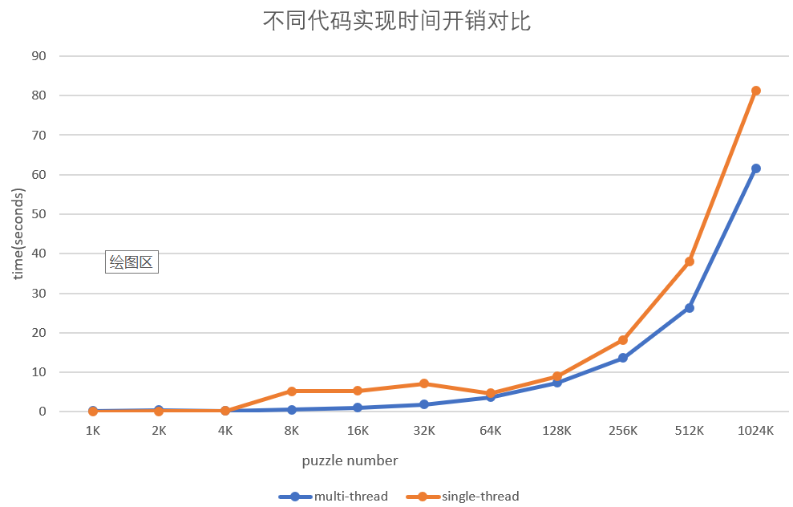

# Lab1 test report

## 1. 实验概要

多线程编程是高性能编程的技术之一，实验1将针对数独求解问题比较多线程与单线程的性能差异、同一功能不同代码实现的性能差异以及多线程在不同硬件环境下的性能差异。

### 1.1 程序输入
本项目完成的是Basic Version，程序将在控制台接收用户输入，该输入应为某一目录下的一个数独谜题文件，该文件包含多个数独谜题，每个数独谜题按固定格式存储在该文件中。

### 1.2 程序输出

实验中把数独的解按与输入相对应的顺序输出到**标准输出stdout**

### 1.3 Sudoku算法

选择的是老师提供的舞蹈链算法，即`dance-link`算法。

### 1.4 性能指标

实验以求解完单个输入文件里的所有数独题并把数独的解按顺序输出到标准输出所需要的时间开销作为性能指标。一般而言，可以用加速比直观地表示并行程序与串行程序之间的性能差异。

（加速比：串行执行时间与并行执行时间的比率，是串行与并行执行时间之间一个具体的比较指标）

为了得到总执行时间，我们在用户输入完文件路径，按下回车之后获取当前时刻为`start`，待结果全部输出到标准输出之后获取时刻为`end`，则`(end - start)`即为我们程序运行的总时间。

### 1.5 实验环境

采用的VMware下的Ubuntu虚拟机，**Linux内核版本为4.4.0-21-generic，2GB内存，使用4内核（这里应该是4线程的意思）**。

CPU型号为Intel(R) Core(TM) i5-7200U CPU @ 2.5GHz 2.7GHz，2内核4线程。

### 1.6 项目结构

* **多线程版本（multi-thread）**：位于`./Lab1`，使用`make`命令可生成可执行文件`sudoku_solve`。

  不带参数的情况：默认开启CPU内核数量的线程；

  带参数的情况：可以指定线程数量为N。

  主线程：负责从文件读入数独，存储在数独队列当中；子线程全部退出后，负责输出所有的解。

  N个子线程：从数独队列当中获取一个数独进行求解，求解完成后将解写入到全局数组当中。

  注：线程与物理核心没有进行绑定。

* **单线程版本（single-thread）**：位于`./Lab1/single-thread`，使用`make`命令可生成可执行文件`sudoku_solve`。

  从老师的代码中抽取舞蹈链算法，进行精简得到。

  主线程：不断地从文件中读取一个数独，求解之后输出；随后继续读取...依次循环

* **测试数据生成器（Test-sample-production）**：位于`./Lab1/Test-sample-production`，使用`make`生成可执行文件`Test-sample-production`

  使用随机挖空算法编写而成的测试数据生成器，在Linux运行之后可以在目录下获得11个测试数据文件，其中包含的数独题目分别为1K，2K，4K，8K，16K，32K，64K，128K，256K，512K和1024K。

* **测试结果（Test-report）**：位于`./Lab1/Test-report`，包含测试的原始数据和图片。

* **批量读入+线程绑核版本（new_version）**：位于`./Lab1/new_version`，使用`make`生成可执行文件`new_version`。

  此版本没有作为最终的版本，仅在多线程版本（multi-thread）的基础上，改进了批量读入数独和线程绑核，进行了少许测试，但是发现加速比并没有得到显著提升。

  注：此版本的测试文件需要在window环境下生成，因为windows下的换行为`"\n\r"`

## 2. 性能测试

程序的性能会受到诸多因素的影响，其中包括软件层面的因素和硬件层面的因素。由于设备配置区别不大，本节将分析比较多线程版本与单线程版本的性能差异，同一功能不同代码实现的性能差异。

### 2.1 多线程与单线程性能比较

单线程版本只能利用1个CPU核心，而多线程程序能使CPU的多个核心并行运作，因此，多线程能够充分发挥多核CPU的优势。在一定范围内，加速比会随着线程数的增加而增长，即时间开销越少、效率越高。当线程数超过CPU核心数时，性能提升将遇到瓶颈，甚至导致下降。

为了比较多线程与单线程性能差异，实验将提供1个大小为84.0MB、具有1024K个数独题的文件，而后分别使用单线程版本的sudoku_solve和n个sudoku_solve分别对该文件内的所有数独题进行求解，并把解输出到屏幕中，测量这一部分所需要的时间开销并计算加速比。

下图展示了不同线程数对性能造成的影响，其两条折线：**Consumed time**和**Speedup**分别表示随sodoku_solve线程数量的变化所需的时间开销和相应的加速比。从图中可以看出，当总线程数小于CPU总核心数时，随着线程数的增加，所需要的时间开销越小、加速比更高，当线程数为内核数时性能和加速比达到最大。随后，当线程数大于5时，性能提升遇到瓶颈。分析其原因，是因为当线程数多于CPU核心数时，必然存在两个线程共用一个CPU内核的情况，此时一个线程没有处理完就可能被切换到另外一个线程，造成了不必要的上下文切换，从而导致CPU的资源没有利用到解决数独上面。

**分析加速比最高达到2.0的原因**

一开始分析原因是每个线程一次只读入一个数独问题，从而导致时间花在上锁解锁的过程中。后来做了一些改进，使得每个线程一次性批量读入N个数独（尝试了N取16，32，64，128），但是加速比没有得到显著变化。后来考虑是不是线程没有绑核，加入了绑核并成功之后，发现加速比也没有得到显著提升。

后面考虑是因为**Amdahl定律**，由于程序当中有很大一部分的时间开销是来源于IO和其它串行部分，因此加速比无法继续上升。如果有更大的测试文件，也许加速比可以突破2.0。

### 2.2 不同代码实现性能比较

接下来，我们比较了多线程版本（multi-thread）开1个线程和单线程版本（single-thread）运行不同大小的测试文件得到的结果，如下图所示。

理论上，由于多线程版本增加了临界区的控制代码（lock、unlock），应该会比单线程版本慢一些，但是图中显示多线程版本的性能是要比单线程好的。

**其原因是我们的多线程版本（multi-thread）在IO方面作出了优化，主要包括以下两点：**

* 将数独的解存放在全局数组当中，当所有问题解决之后一并输出。这有助于提高IO的连续性，顺序写入标准输出，比不连贯的输出要快很多。
* 首先将数独的解由int[81]转化为char[81]，随后char[81]便能以字符串的形式打印到屏幕上，较输出整形要快不少。

