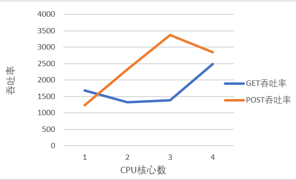
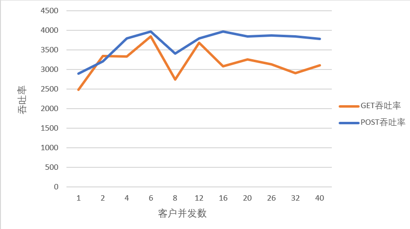

# Lab2 test report

> by M78星云

## 1. 实验概要

利用课程中学到的网络编程知识，从头开始构建基于HTTP/1.1的HTTP服务器，并使用从高并发编程技巧来保证Web服务器的性能。

### 1.1 程序输入输出

```shell
# 提升httpserver.sh的运行权限
> chmod +x httpserver.sh
# 编译
> make
# 运行
> ./httpserver --ip 127.0.0.1 --port 8080 --number-thread 8
```

### 1.2 实验的大致流程

服务端：使用`java`编写，使用线程池（默认大小为CPU核心数的2倍）保证并发性。

测试：使用Apache-Benchmark进行了压力测试。

### 1.3 实验环境

采用的VMvare下的Ubuntu虚拟机，Linux内核版本为4.4.0-21-generic；2GB内存；使用四内核（这里应该是4线程的意思）。CPU型号为Intel(R) Core(TM) i5-7200U CPU @ 2.70GHz，2内核4线程。

## 2. 性能测试

由于条件所限，本次实验的服务端和客户端均在同一机器上运行，因此结果可能与实际性能有较大偏差。

吞吐率的定义：Requests per second，即每秒钟服务器能够处理请求的数量。

### 2.1 不同运行环境时的吞吐率

**通过改变虚拟机的CPU核心数量，考察在不同环境时服务器的性能。**

服务器：使用默认的线程池大小（CPU核心数的两倍）

AB测试：会话中所执行的请求个数为`-n 10000`，并发等级（并发数）为`-c 8`

**性能分析**

服务器端使用的是多线程的方法，因此当CPU核心数量增加时，不同的线程可以运行在更多的内核当中，加快处理的速率。



### 2.2 不同并发等级下的吞吐率

**通过改变AB测试的并发等级`-c xxx`，测试在高并发的情况下服务器的性能。**

环境：使用CPU为4核的环境

服务器：使用默认的线程池大小（CPU核心数的两倍）

AB测试：会话中所执行的请求个数为`-n 10000`，并发等级从1~40非均匀递增



**性能分析**

当并发数较小时，服务器的处理能力没有完全发挥出来。而当AB测试的并发等级增加时，服务器的处理能力达到瓶颈，逐渐稳定在3800次/秒。此外，每个任务的处理时延增加（但是没有出现拒绝的现象），这是因为若待处理的请求数量超过线程池的大小后，将会进入无界队列进行排队，增加的时延主要是排队时延。